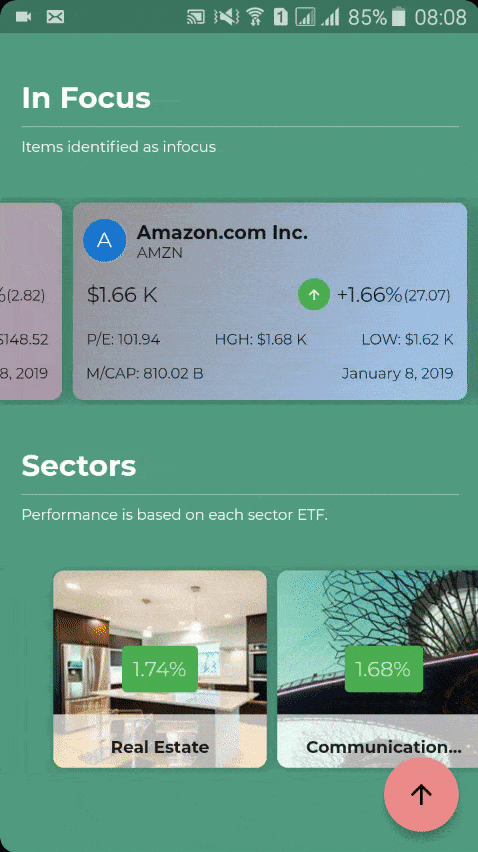

# Peek

Peek is a market expolorer application built using BLoC pattern. It provides an interface built to load stock market information asyncronously 
from [IEX api (v1)](https://iextrading.com/developer/), and presents it to the users.

## Features

# View sector perfomance and browse entries under each sector
# Search for tickers to view quote and historical data etc.
# View Candlestick chart of historical information
# View Key statistics about a tickers

“Data provided for free by [IEX api (v1)](https://iextrading.com/developer/). View IEX’s [Terms of Use](https://iextrading.com/api-exhibit-a/).”
